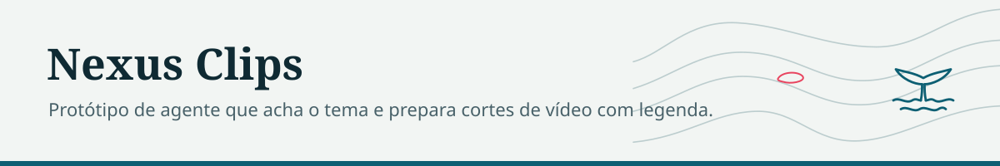

<picture>
  <source media="(prefers-color-scheme: dark)" srcset="docs/marca/cabecalho-escuro.svg">
  
</picture>

# Nexus Clips

Agente autonomo de IA que monitora fontes em tempo real, detecta momentos virais e gera cortes/videos automaticamente para TikTok, Reels, Shorts e X.


<sub>Front real do painel, servido com uma API local de dados fictícios.</sub>

## Stack

- **Backend**: Python 3.12+ / FastAPI / Pydantic v2 / SQLAlchemy async
- **IA Pipeline**: LangChain + LangGraph (orquestracao de agentes)
- **Classificacao**: Claude API (Anthropic)
- **Visao**: Google Cloud Vision
- **Transcricao**: OpenAI Whisper (local)
- **Voz**: Edge TTS (gratis) / Google TTS / ElevenLabs
- **Video**: FFmpeg + yt-dlp
- **Frontend**: React + Vite + Tailwind CSS + Recharts
- **DB**: SQLite + aiosqlite

## Arquitetura

```
Sources (Twitter, YouTube, RSS)
         |
         v
   [ LangGraph Pipeline ]
         |
    classify_node ──► is_relevant?
         |                  |
        YES                NO → skip
         |
    strategize_node
         |
    ┌────┼────────┐
    v    v        v
 caption growth channels   (paralelo)
    |    |        |
    └────┼────────┘
         v
     save_node → DB
         |
         v
     Dashboard
```

## Canais

| Canal | Tema | Vies | Tom |
|-------|------|------|-----|
| Guerra Agora | Guerra | Neutro | Urgente |
| Gol a Gol | Futebol | Neutro | Informal |
| Brasil Livre News | Politica | Direita | Polemico |
| Povo Informa | Politica | Esquerda | Polemico |
| Viralizou BR | Trending | Neutro | Informal |

## Setup

```bash
# Backend
python -m venv .venv
source .venv/bin/activate
pip install -e .
cp .env.example .env  # preencher API keys

# Frontend
cd dashboard
npm install

# Rodar
python main.py         # API em http://localhost:8000
cd dashboard && npm run dev  # Frontend em http://localhost:5173
```

## API Keys necessarias

| Servico | Variavel | Obrigatorio |
|---------|----------|-------------|
| Claude (Anthropic) | `ANTHROPIC_API_KEY` | Sim |
| Twitter/X | `TWITTER_BEARER_TOKEN` | Opcional |
| YouTube | `YOUTUBE_API_KEY` | Opcional |
| Google Vision | `GOOGLE_APPLICATION_CREDENTIALS` | Opcional |
| Telegram Bot | `TELEGRAM_BOT_TOKEN` + `TELEGRAM_CHANNEL_ID` | Opcional |

## Endpoints

| Metodo | Path | Descricao |
|--------|------|-----------|
| GET | `/api/clips` | Lista clips com filtros |
| POST | `/api/clips/{id}/publish` | Publica um clip |
| DELETE | `/api/clips/{id}` | Remove um clip |
| GET | `/api/sources` | Lista fontes monitoradas |
| POST | `/api/sources` | Adiciona nova fonte |
| DELETE | `/api/sources/{id}` | Remove fonte |
| PATCH | `/api/sources/{id}/toggle` | Ativa/desativa fonte |
| GET | `/api/trending` | Trending topics atuais |
| GET | `/api/analytics` | Dashboard analytics |
| GET | `/api/settings` | Configuracoes |
| PATCH | `/api/settings` | Atualiza configuracoes |
| GET | `/api/sse` | Server-Sent Events (real-time) |

## Roadmap

- [x] Scaffold completo (backend + frontend)
- [x] LangChain + LangGraph pipeline
- [x] Multi-channel (direita/esquerda/neutro)
- [x] Growth strategy (canais do zero)
- [ ] Pipeline end-to-end com dados reais
- [ ] Voice TTS + legendas estilizadas
- [ ] Upload automatico (TikTok, Reels, Shorts)
- [ ] Analytics com dados reais
- [ ] Deploy GCP
- [ ] Copa do Mundo 2026
- [ ] Eleicoes 2026

## Status

Scaffold completo (backend FastAPI + pipeline LangGraph + dashboard React), em
evolucao. Pipeline end-to-end e uploads automaticos ainda em andamento (ver Roadmap).
Projeto pessoal, sem suite de testes automatizada ainda.
